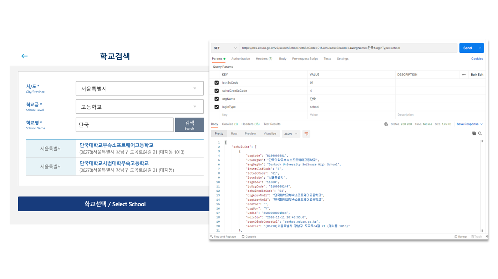
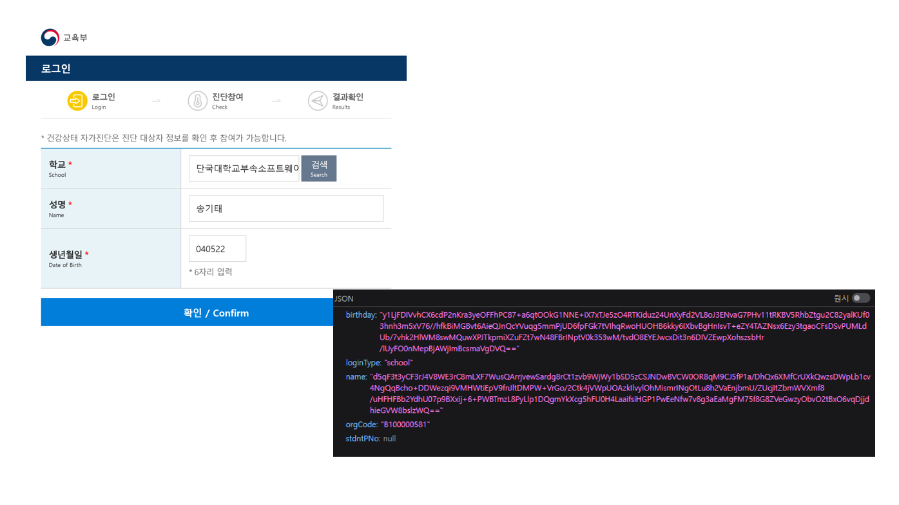

# 건강상태 자가진단 웹사이트를 이용한 학교 인증 API

# Introduce
>
> 교육부가 운영하는 건강상태 자가진단 웹사이트( https://hcs.eduro.go.kr )를 분석하고, 이를 통해 학교 인증 API를 제작했습니다.
>
> 이 Repository는 오픈소스로 관리됩니다. 직접 PR 넣어주시면 코드리뷰 진행 후 배포하겠습니다.
> 
> **이 API를 사용하여 생기는 모든 문제의 책임은 사용자에게 있습니다.**
>

# Tech Stack
- Axios (HTTP Request)
- node-jsencrypt-fix (RSA Encrypt)

# Example
```typescript
import SchoolAuth from './index';

const schoolAuth = new SchoolAuth();
schoolAuth.init(schoolAuth._data.REGION.SEOUL[1], 'B100000581');

const f1 = async () => {
    const schoolList = await schoolAuth.searchSchool(
        schoolAuth._data.REGION.SEOUL[0],
        schoolAuth._data.EDUTYPE.HIGH,
        '단국대학교'
    );
    console.log(schoolList)
}

const f2 = async () => {
    const authResult = await schoolAuth.findUser('송기태', '040522')
    console.log(authResult)
}

/* Function_1 Output */
f1();

/*
{
  isError: false,
  message: '데이터를 로드하는데 성공했습니다.',
  schoolList: [
    {
      schoolCode: 'B100000581',
      schoolName: '단국대학교부속소프트웨어고등학교',
      authURL: 'senhcs.eduro.go.kr'
    },
    {
      schoolCode: 'B100000405',
      schoolName: '단국대학교사범대학부속고등학교',
      authURL: 'senhcs.eduro.go.kr'
    }
  ]
}
*/

/* Function_2 Output */
f2();

/*
{
  isError: false,
  message: '학생 인증에 성공했습니다.',
  userName: '송기태',
  userBirthday: '040522'
}
*/
```

# API Analytics
>
> `LOG의 BLOG`님의 블로그 글 'https://nnnlog.tistory.com/18' 을 읽고 참고했습니다.
> 

## 학교 검색

- **Method: `GET`**
- **Base URL: https://hcs.eduro.go.kr/v2/searchSchool**

| # | Parameter | Description | Required |
| - | --- | ---- | -------- |
| 1 | lctnScCode | [교육청 관할 지역](#교육청-관할-지역) | O |
| 2 | schulCrseScCode | [학교 종류](#교육기관-종류) | O |
| 3 | orgName | 학교 이름 | O |
| 4 | loginType | `school`, `univ`, `office` | X (default_value: `school`)|


## 사용자 찾기

- **Method: `POST`**
- **Base URL: https://{교육청}hcs.eduro.go.kr/v2/findUser**

| # | Parameter | Description | Required |
| - | --- | ---- | -------- |
| 1 | name | RSA로 암호화 된 학생 이름 | O |
| 2 | birthday | RSA로 암호화 된 학생 생년월일 6자리 (ex. YYMMDD) | O |
| 3 | orgCode | 학교 UUID | O |
| 4 | loginType | `school`, `univ`, `office` | X (default_value: `school`)|

----
## **교육청 관할 지역**

| # | 지역 | Value |
| -- | -- | -- |
| 1 | 서울 | `01` |
| 2 | 부산 | `02` |
| 3 | 대구 | `03` |
| 4 | 인천 | `04` |
| 5 | 광주 | `05` |
| 6 | 대전 | `06` |
| 7 | 울산 | `07` |
| 8 | 세종 | `08` |
| 9 | 경기 | `10` |
| 10 | 강원 | `11` |
| 11 | 충북 | `12` |
| 12 | 충남 | `13` |
| 13 | 전북 | `14` |
| 14 | 전남 | `15` |
| 15 | 경북 | `16` |
| 16 | 경남 | `17` |
| 17 | 제주 | `18` |

## **교육기관 종류**

| # | 유형 | Value |
| -- | -- | -- |
| 1 | 유치원 | `1` |
| 2 | 초등학교 | `2` |
| 3 | 중학교 | `3` |
| 4 | 고등학교 | `4` |
| 5 | 특수학교 | `5` |

# Document

## `SchoolAuth`
아래 코드로 SchoolAuth 클래스의 인스턴스를 생성할 수 있습니다.

```typescript
import SchoolAuth from './src'

const schoolAuth = new SchoolAuth();
```

## `SchoolAuth._data`
### **교육청 관할 지역**
교육청 관할 지역은 `SchoolAuth._data`에서 선택할 수 있습니다.

| # | 지역 | Key | Value | Type |
| -- | -- | -- | -- | -- |
| 1 | 서울 | `SEOUL` | [`01`, `senhcs.eduro.go.kr`] | string[]
| 2 | 부산 | `BUSAN` | [`02`, `penhcs.eduro.go.kr`] | string[]
| 3 | 대구 | `DAEGU` | [`03`, `dgehcs.eduro.go.kr`] | string[]
| 4 | 인천 | `INCHEON` | [`04`, `icehcs.eduro.go.kr`] | string[]
| 5 | 광주 | `GWANGJU` | [`05`, `genhcs.eduro.go.kr`] | string[]
| 6 | 대전 | `DAEJEON` | [`06`, `dgehcs.eduro.go.kr`] | string[]
| 7 | 울산 | `ULSAN` | [`07`, `usehcs.eduro.go.kr`] | string[]
| 8 | 세종 | `SEJONG` | [`08`, `sjehcs.eduro.go.kr`] | string[]
| 9 | 경기 | `GYEONGGI` | [`10`, `goehcs.eduro.go.kr`] | string[]
| 10 | 강원 | `KANGWON` | [`11`, `kwehcs.eduro.go.kr`] | string[]
| 11 | 충북 | `CHUNGBUK` | [`12`, `cbehcs.eduro.go.kr`] | string[]
| 12 | 충남 | `CHUNGNAM` | [`13`, `cnehcs.eduro.go.kr`] | string[]
| 13 | 전북 | `JEONBUK` | [`14`, `jbehcs.eduro.go.kr`] | string[]
| 14 | 전남 | `JEONNAM` | [`15`, `jnehcs.eduro.go.kr`] | string[]
| 15 | 경북 | `GYEONGBUK` | [`16`, `gbehcs.eduro.go.kr`] | string[]
| 16 | 경남 | `GYEONGNAM` | [`17`, `gnehcs.eduro.go.kr`] | string[]
| 17 | 제주 | `JEJU` | [`18`, `jjehcs.eduro.go.kr`] | string[]

#### Example
```typescript
const schoolAuth = new SchoolAuth();

console.log(schoolAuth._data.REGION.SEOUL[0]) // '01'
console.log(schoolAuth._data.REGION.SEOUL[1]) // 'senhcs.eduro.go.kr'
```

### **교육기관 종류**

| # | 유형 | Key | Value | Type |
| -- | -- | -- | -- | -- |
| 1 | 유치원 | `KINDERGARTEN` | `1` | `string` |
| 2 | 초등학교 | `ELEMENTARY` | `2` | `string` |
| 3 | 중학교 | `MIDDLE` | `3` | `string` |
| 4 | 고등학교 | `HIGH` | `4` | `string` |
| 5 | 특수학교 | `SPECIAL` | `5` | `string` |

#### Example
```typescript
const schoolAuth = new SchoolAuth();

console.log(schoolAuth._data.EDUTYPE.ELEMENTARY) // '2'
console.log(schoolAuth._data.EDUTYPE.HIGH) // '4'
```

## `SchoolAuth.init()`
인스턴스를 지정한 학교로 초기화 합니다.

| # | Parameter | Type | Description |
| -- | -- | -- | -- |
| 1 | authURL | `string` | 관할 교육청 URL |
| 2 | schoolCode | `string` | 학교 UUID |

**Return Type: `void`**

### Example
```typescript
const schoolAuth = new SchoolAuth();

schoolAuth.init(schoolAuth._data.REGION.SEOUL[1], 'B100000581');
```

## `SchoolAuth.searchSchool()`
인수로 전달한 String 값을 가진 학교 목록을 반환합니다.

| # | Parameter | Type | Description |
| -- | -- | -- | -- |
| 1 | locationType | `string` | 교육청 관할 지역 |
| 2 | schoolType | `string` | 교육기관 종류 |
| 3 | schoolName | `string` | 학교 이름 |

**Return Type: [여기를 클릭하여 *searchSchoolType*를 읽어주세요!](./src/types/index.ts)**

### Example
```typescript
const schoolAuth = new SchoolAuth();

const f1 = async () => {
    const schoolList = await schoolAuth.searchSchool(
        schoolAuth._data.REGION.SEOUL[0],
        schoolAuth._data.EDUTYPE.HIGH,
        '단국대학교'
    );
    console.log(schoolList)
}

f1();
```

## `SchoolAuth.findUser()`
지정한 학교에 이름과 생년월일(YYMMDD)을 가진 학생이 있는지 검사합니다.

**`SchoolAuth.init()` 호출 없이 `SchoolAuth.findUser()`을 시도하는 경우, Error가 throw됩니다.**

| # | Parameter | Type | Description |
| -- | -- | -- | -- |
| 1 | userName | `string` | 학생 이름 |
| 2 | userBirthday | `string` | 학생 생년월일 (YYMMDD) |

**Return Type: [여기를 클릭하여 *findUserType*를 읽어주세요!](./src/types/index.ts)**

### Example
```typescript
const schoolAuth = new SchoolAuth();

schoolAuth.init(schoolAuth._data.REGION.SEOUL[1], 'B100000581');

const f2 = async () => {
    const authResult = await schoolAuth.findUser('송기태', '040522')
    console.log(authResult)
}

f2();
```

# Bug report / FeedBack

이 프로젝트를 이용하다가 생긴 버그나 추가했으면 하는 기능들은 이슈를 남겨주세요.

또한 직접 PR을 넣어주시면 확인 후 반영하겠습니다. 감사합니다.